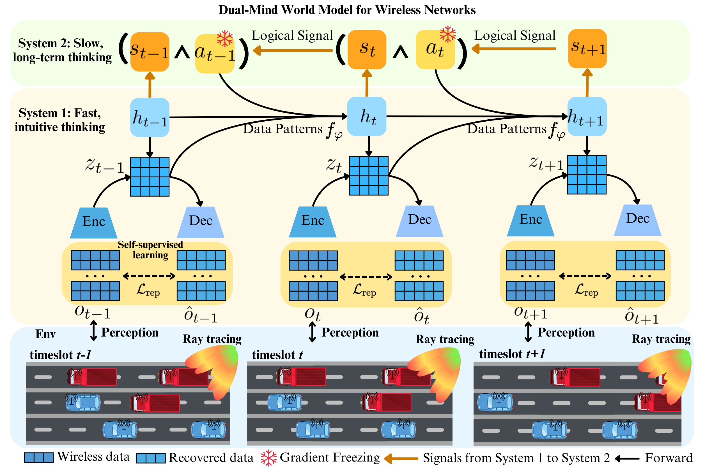
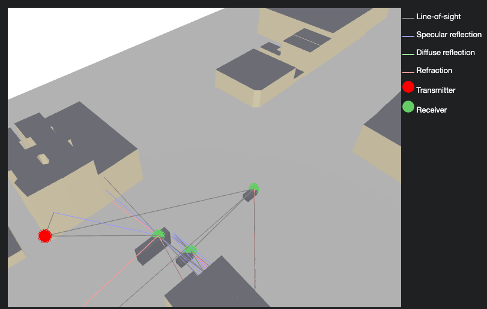

# Dual-Mind World Models: A General Framework for Learning in Dynamic Wireless Networks

Official implementation of **“Dual-mind world models: A general framework for learning in dynamic wireless networks”**.

<p align="center">
  <span style="background-color: white; display: inline-block; padding: 10px;">
    
  </span>
</p>

## 1. Customized Sionna RT Environment With Dynamic Vehicles

The notebook **mmWave.ipynb** provides a standalone sanity test for the customized Sionna-based mmWave V2X
environment used in this project.

The test includes:

- loading a customized Mitsuba scene into Sionna RT;
- configuring the carrier frequency at 26 GHz;
- configuring antenna arrays for the roadside unit (RSU) and vehicles;
- creating V2I and V2V transmitters and receivers;
- adding physical 3D vehicle meshes to the propagation environment;
- updating vehicle positions and the corresponding TX/RX positions;
- updating the scene geometry after vehicle movement;
- re-running the Sionna RT PathSolver for every new vehicle configuration;
- extracting channel impulse responses (CIRs);
- extracting delay, AoA, and AoD information;
- calculating effective ray-tracing-based channel gains;
- calculating V2I/V2V achievable rates; and
- converting the achievable rate into packets transmitted per timeslot.


<p align="center">
  
</p>

## 2. Installation

A clean Python environment is recommended.

```bash
conda create -n dmwm_sionna python=3.10 -y
conda activate dmwm_sionna
pip install -r requirements.txt
```

On macOS, Dr.Jit's LLVM backend requires LLVM:

```bash
brew install llvm
```

---

## 3. Train

The following command contains the complete set of value-based training
parameters exposed by the current implementation. The values shown below
correspond to the default paper-scale configuration and can be modified
directly.

```bash
python main.py \
  --run-id 1 \
  --seed 41 \
  --scene itu_scene/itu_scene.xml \
  --num-v 8 \
  --num-antennas 4 \
  --road-length 200 \
  --min-gap 20 \
  --tx-power-dbm 23 \
  --bandwidth 100e6 \
  --frequency 26e9 \
  --slot-duration 0.1 \
  --packet-size-bytes 5e6 \
  --num-packets 25 \
  --caoi-tolerance 8 \
  --max-episode-length 100 \
  --noise-figure-db 0 \
  --max-depth 5 \
  --max-num-paths 4000 \
  --samples-per-src 20000 \
  --embedding-size 384 \
  --hidden-size 256 \
  --belief-size 256 \
  --state-size 256 \
  --free-nats 1.0 \
  --dyn-weight 1.0 \
  --rep-weight 1.0 \
  --logic-vector-size 64 \
  --reasoning-depth 30 \
  --logic-reg-weight 0.1 \
  --logic-guidance-weight 10.0 \
  --logic-learning-rate 1e-2 \
  --model-logic-learning-rate 1e-3 \
  --episodes 1000 \
  --seed-episodes 5 \
  --collect-interval 100 \
  --experience-size 1000000 \
  --batch-size 50 \
  --sequence-length 64 \
  --planning-horizon 30 \
  --imagination-starts 256 \
  --discount 0.99 \
  --return-lambda 0.95 \
  --action-noise 0.3 \
  --model-learning-rate 1e-3 \
  --actor-learning-rate 1e-4 \
  --value-learning-rate 1e-4 \
  --adam-epsilon 1e-7 \
  --grad-clip-norm 100 \
  --test-episodes 10 \
  --test-interval 25 \
  --prediction-drop-prob 0.0 \
  --checkpoint-interval 25 \
  --device auto
```

---

## 4. Test

Evaluate a trained checkpoint using the same environment and model dimensions
that were used during training.

```bash
python main.py \
  --test \
  --models results/1/models_1000.pth \
  --run-id test_1 \
  --seed 41 \
  --scene itu_scene/itu_scene.xml \
  --num-v 8 \
  --num-antennas 4 \
  --road-length 200 \
  --min-gap 20 \
  --tx-power-dbm 23 \
  --bandwidth 100e6 \
  --frequency 26e9 \
  --slot-duration 0.1 \
  --packet-size-bytes 5e6 \
  --num-packets 25 \
  --caoi-tolerance 8 \
  --max-episode-length 100 \
  --noise-figure-db 0 \
  --max-depth 5 \
  --max-num-paths 4000 \
  --samples-per-src 20000 \
  --embedding-size 384 \
  --hidden-size 256 \
  --belief-size 256 \
  --state-size 256 \
  --logic-vector-size 64 \
  --reasoning-depth 30 \
  --planning-horizon 30 \
  --discount 0.99 \
  --return-lambda 0.95 \
  --test-episodes 100 \
  --prediction-drop-prob 0.0 \
  --device auto
```

---

## 5. Citation

If you use this repository in your research, please cite:

```bibtex
@article{wang2025dual,
  title={Dual-mind world models: A general framework for learning in dynamic wireless networks},
  author={Wang, Lingyi and Shelim, Rashed and Saad, Walid and Ramakrishnan, Naren},
  journal={arXiv preprint arXiv:2510.24546},
  year={2025}
}
```

---

## 6. License

All content in this repository is released under the MIT License.

```text
MIT License

Copyright (c) 2025 NEWS@VT
```

Third-party dependencies, including Sionna RT, Mitsuba, Dr.Jit, PyTorch, and
their associated components, remain subject to their respective licenses.
